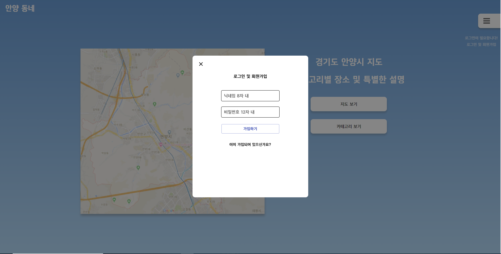
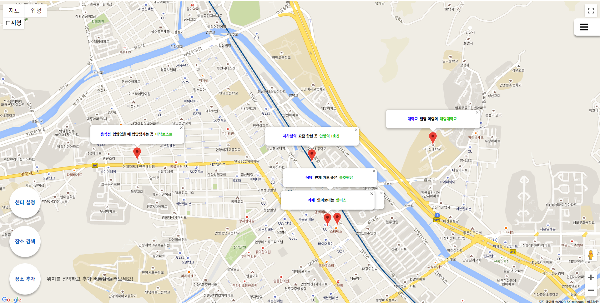
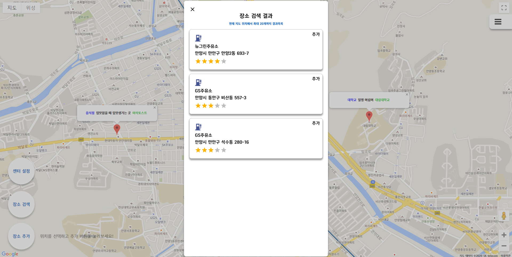
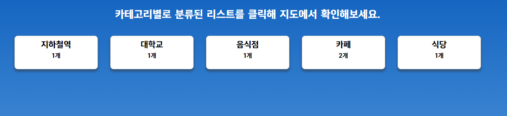

# 안양 동네 앱

안양 시의 주변 장소 및 맛집 등을 검색하고 추가할 수 있는 웹 포트폴리오 입니다.  
구글 맵 API를 이용하여, 추가한 장소를 클릭 시 구글의 상세 페이지로 이동하고,  
해당 내용을 기록하여 다음 번 호출을 빠르게 합니다.

---

### Client - Server

-   React ( Hook )
-   Material UI
-   Express
-   Mysql & Sequelize ORM
-   JWT

### 외부 API

-   Google Map Api (javascript)

### 툴

-   Vscode ( 작업 )
-   Workvench ( 데이터 베이스 )
-   Postman ( Http 요청 테스트 )
-   SourceTree ( 프로젝트 관리 )

### 이미지 첨부

---

로그인은 큰 인증없이 아이디 비밀번호만으로 가입하고 로그인합니다.  
해당 내용을 로컬 스토리지에 토큰을 저장하고, 해당 토큰의 액세스 키를 확인, 액세스 키 값 만료시 리프레시 토큰을 확인합니다.  

---

시점 설정, 장소 검색 및 추가 기능과 데이터베이스에서 장소 데이터를 가져와 마커로 표시합니다. 마커 클릭 시 구글의 상세 페이지로 이동합니다.

---

장소 찾기 기능 및 추가를 합니다.

---

카테고리별로 구분하고, 해당 카테고리 클릭 시 해당 카테고리의 장소들만을 지도에 보여줍니다.

